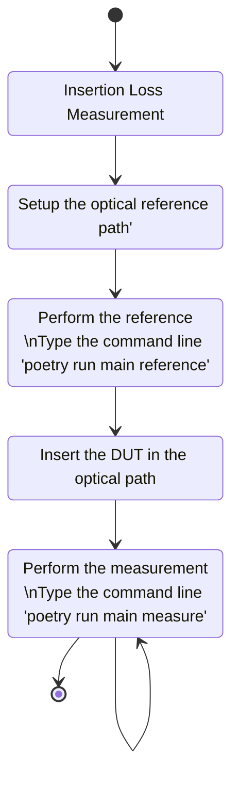

# How to use

To process an insertion loss measurement with this example, you should follow these steps.

```mermaid
stateDiagram
    state "Insertion Loss Measurement" as Initial
    state "Setup the optical reference path'" as ReferenceSetup
    state "<center>Perform the reference</center>\nType the command line 'poetry run main reference'" as Reference
    state "Insert the DUT in the optical path" as MeasurementSetup
    state "<center>Perform the measurement</center>\nType the command line 'poetry run main measure'" as Measurement

    [*] --> Initial
    Initial --> ReferenceSetup
    ReferenceSetup --> Reference
    Reference --> MeasurementSetup
    MeasurementSetup --> Measurement
    Measurement --> Measurement
    Measurement --> [*]
```